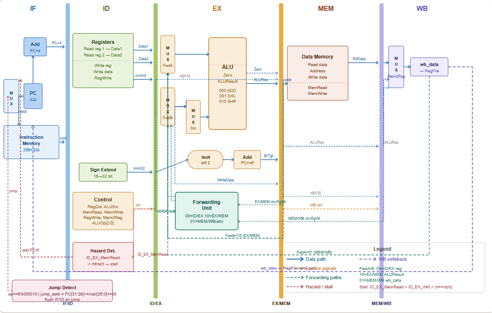
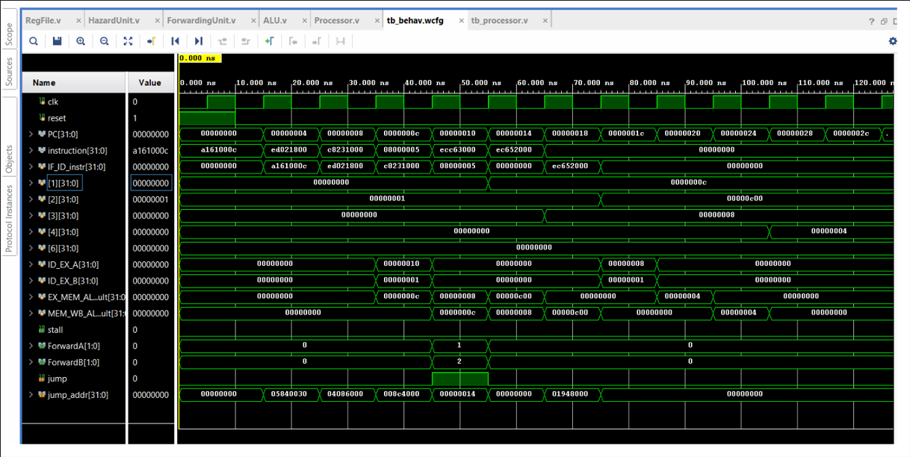

# 5-Stage Pipelined MIPS Processor in Verilog HDL

<p align="center">
  
  
  
  
</p>
## Complete Datapath

<p align="center">
  
</p>

## Simulation Waveform

<p align="center">
  
</p>
---

## Overview

A complete **5-stage pipelined MIPS-style processor** designed and implemented in **Verilog HDL**.

This project demonstrates:

- Pipeline execution
- Hazard detection
- Stall insertion
- Forwarding logic
- Jump handling
- RTL simulation
- FPGA synthesis using **Xilinx Vivado**

---

## Pipeline Stages

```text
IF  →  ID  →  EX  →  MEM  →  WB